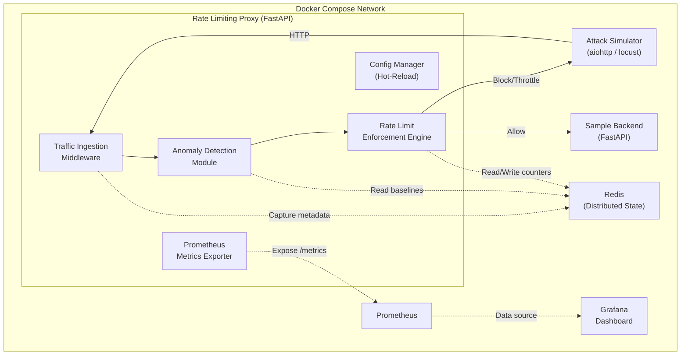

# Distributed Adaptive Rate Limiting System for DDoS Mitigation

This repository contains a production-grade, distributed Adaptive Rate Limiting System designed to protect HTTP services from Distributed Denial-of-Service (DDoS) and abusive traffic. Instead of static, fixed thresholds, it dynamically adjusts client rate limits based on statistical traffic anomalies and downstream system health.

## System Architecture



### Component Breakdown
1. **Traffic Ingestion Middleware**: Sits in front of the backend service. Captures source IP (parsing `X-Forwarded-For`), HTTP method, request path, headers, content length, and monotonic arrival time. Enforces whitelists and blacklists using CIDR blocks.
2. **Anomaly / Attack Detection Module**: Computes Exponentially Weighted Moving Averages (EWMA) of request rates per client IP and calculates standard deviations. Evaluates Z-scores to identify statistical spikes. Detects slow HTTP connection (Slowloris) behaviors.
3. **Global System Monitor**: Monotors backend latency and 5xx error response rates to adjust global rate limiter constraints.
4. **Rate Limit Enforcement Engine**: Implements the strategy pattern with three swappable Redis Lua-backed rate limiting algorithms (Token Bucket, Sliding Window Counter, Leaky Bucket). Dynamically scales limit capacities and refill rates, escalating client states through 5 tiers:
   - **Level 0 (ALLOW)**: Requests allowed normally.
   - **Level 1 (THROTTLE)**: Limits exceeded, returns `429 Too Many Requests` with a `Retry-After` header.
   - **Level 2 (CHALLENGE)**: Returns a `403 Forbidden` simulating a CAPTCHA challenge requirement.
   - **Level 3 (TEMP_BLOCK)**: Temporarily blocks all traffic from the client IP for N seconds (returns `403 Forbidden`).
   - **Level 4 (FULL_BLOCK)**: Persistently blocks/blacklists the client IP.
5. **Distributed State Store (Redis)**: Shares rate limit counters, EWMA baselines, and escalation states across horizontally scaled proxy instances. Uses atomic Lua scripting to prevent race conditions. Includes a local in-memory fallback cache to ensure the proxy remains available if Redis experiences an outage.
6. **Observability**: Exposes structured JSON logs (via `structlog`) and Prometheus metrics `/metrics` to power a pre-provisioned Grafana dashboard.

---

## How the Adaptive Logic Works

```
[Incoming Request] ──> [Ingestion Middleware] ──> [Blacklist/Whitelist Check]
                                                            │
                                                     (If not listed)
                                                            ▼
                                                [Compute Anomaly Score]
                                             (EWMA Baseline & Z-Score)
                                                            │
                                                            ▼
                                                [Compute System Load Score]
                                             (Backend Latency & Error Rate)
                                                            │
                                                            ▼
                                                 [Calculate Adaptive Limit]
                                          limit = base * (1 - anomaly * severity)
                                                        * load_multiplier
                                                            │
                                                            ▼
                                                 [Algorithm Limit Check]
                                                    /             \
                                          (If Under Limit)    (If Over Limit)
                                                /                     \
                                               ▼                       ▼
                                            [ALLOW]           [Escalate Response Tier]
                                                       (Throttle -> Challenge -> Block)
```

### Mathematical Formulation
1. **EWMA Baseline**: 
   $$Rate_{EWMA}(t) = \alpha \cdot Rate_{Current} + (1 - \alpha) \cdot Rate_{EWMA}(t-1)$$
   Where $\alpha$ (smoothing factor) is configured in `default_config.yaml` (default: 0.3).
2. **Z-Score Anomaly Score**:
   $$Z = \frac{Rate_{Current} - Rate_{EWMA}}{\sigma_{EWMA}}$$
   Where $\sigma_{EWMA}$ is the running standard deviation. The computed Z-score is clamped and normalized relative to the configured threshold (default: 3.0) to output an anomaly score between `0.0` (normal) and `1.0` (critical spike).
3. **Adaptive Limit Calculation**:
   $$Limit_{Adjusted} = Limit_{Base} \cdot (1 - Score_{Anomaly} \cdot Severity_{Factor}) \cdot Multiplier_{Load}$$
   Where $Severity_{Factor}$ represents mitigation aggressiveness (default: 0.7) and $Multiplier_{Load}$ scales down linearly (down to a minimum of 0.3) if downstream backend error rates or latencies cross thresholds.

---

## Technical Stack
- **Language**: Python (FastAPI with `async/await` for high-throughput concurrency)
- **State Store**: Redis 7 (with native Lua scripting)
- **Monitoring & Metrics**: Prometheus + Grafana (with pre-provisioned dashboards)
- **Testing & Simulation**: custom `aiohttp` script + Locust load tests
- **Containerization**: Docker & Docker Compose

---

## Quick Start Setup

### Prerequisites
- Docker & Docker Compose
- Python 3.10+ (for local development/testing)

### 1. Build and Run the Stack
Spin up Uvicorn rate limiting proxy, backend app, Redis, Prometheus, and Grafana in a single command:
```bash
docker compose up --build -d
```
All containers will run inside an isolated Docker network. The proxy is exposed to the host at port `8090`.

### 2. Verify Health
Verify the stack is up and healthy:
- **Rate Limiting Proxy**: [http://localhost:8090/health](http://localhost:8090/health) (proxies to backend)
- **Prometheus Metrics**: [http://localhost:8090/metrics](http://localhost:8090/metrics)
- **Prometheus Server**: [http://localhost:9090](http://localhost:9090)
- **Grafana Dashboard**: [http://localhost:3000](http://localhost:3000) (credentials: `admin`/`admin`. Navigate to Dashboards -> DDoS Mitigation -> Adaptive Rate Limiting)

### 3. Run Attack Simulation
Run the custom asynchronous script to generate legitimate baseline traffic, a volumetric DDoS flood, and distributed slow-connection attacks:
```bash
# Set up a local virtual environment
python -m venv .venv
.venv\Scripts\activate

# Install dependencies (runs editable mode)
pip install -e .
pip install aiohttp

# Run the simulation
python tests/simulation/run_simulation.py
```
This runs a 45-second traffic profile and generates a detailed performance report in `tests/simulation/simulation_report.md`.

---

## Configuration & Policy Management
The system configuration is defined in `config/default_config.yaml`. The proxy monitors this file for changes using a file system watcher (`watchdog`). 

To update rate limit policies, whitelists/blacklists, or anomaly thresholds, edit `config/default_config.yaml` directly. The proxy will dynamically validate constraints via Pydantic models and hot-reload policies **without restarting or dropping connections**.

---

## Verification & Testing
Execute the complete test suite verifying the Token Bucket, Sliding Window, Leaky Bucket, EWMA anomaly scoring, config reloader, and integration proxy routers:
```bash
pytest tests/ -v
```

---

## Security Caveats & Limitations
1. **IP Spoofing Protection**: This system operates at L7 (application layer). It relies on the client IP address (parsed from `X-Forwarded-For` or the direct connection socket) for identifying clients. Under L3/L4 volumetric floods, attackers can spoof source IPs during raw packet transmission; this system is designed to handle L7 application-level traffic abuse and must be backed by L3/L4 edge scrubbing (e.g., Cloudflare, AWS Shield) in production.
2. **State Store Availability (Fail-Safe)**: In the event of a Redis cluster outage, the proxy automatically downgrades to local in-memory fallback structures. This prevents security validation from failing closed (which would take the service down) but leaves the proxy susceptible to out-of-sync limits across horizontal replicas during the outage.
3. **Cookie / Fingerprint Hijacking**: Fingerprinting (like user-agent hashes) can be easily mimicked by attackers using tools like headless browsers. Authenticated headers or cookies are recommended to supplement IP-based client tracking.
